<h1 align='center'>
    基于预划分与动态调优的复杂网络社区发现算法研究
</h1>

## 摘要
社区发现是复杂网络分析的核心任务之一,然而现有算法在准确性和稳定性方面仍面临诸多挑战。针对这一问题,本文提出了一种融合预划分与动态调优的双阶段社区发现框架DualFuse-CD。该方法首先通过Top-K相似度剪枝与双阈值过滤构建多层次优化子图,实现对原始网络结构的自适应优化；随后采用异构图融合策略整合不同粒度的结构信息,并结合Louvain算法进行动态社区划分。在10个合成数据集和8个真实网络数据集上的实验表明,DualFuse-CD在社区检测的准确性、稳定性方面显著优于LPA、Louvain等现有方法。此外,多次运行结果验证了该算法良好的鲁棒性,有效克服了传统方法的随机性问题。DualFuse-CD在保持线性时间复杂度的同时,为复杂网络社区发现提供了一种高效、稳健的解决方案,为社交网络分析、金融风控等实际应用提供了有益参考。未来研究方向包括算法效率优化、多视角异构图融合以及动态社区演化分析等。

#### 关键词：
复杂网络; 社区发现; 异构图融合; Top-K剪枝; Louvain算法; 稳定性

## 引言
复杂网络中的社区发现是图数据挖掘与分析的核心任务之一，其目标是通过识别节点间的紧密关联将网络划分为若干功能模块。这一技术在社交网络分析、生物蛋白质相互作用研究、推荐系统优化等领域具有重要应用价值。高质量的社区划分能够有效揭示网络内在功能结构，为舆情传播分析、关键节点识别等下游任务提供基础支撑。然而，随着网络规模的增长与动态性增强，传统社区发现算法在准确性和稳定性方面面临严峻挑战，尤其在大规模动态图数据场景下，如何高效生成鲁棒且可解释的社区划分结果成为亟待突破的关键问题。

当前主流社区发现方法可分为优化模块度的层次聚类、基于标签传播的启发式算法以及概率图模型三大类。以Louvain算法[1]为代表的模块度优化方法通过局部贪心策略迭代合并节点，在效率与质量间取得较好平衡；GN算法[4]则通过递归移除边介数实现层次化划分，但计算复杂度较高；Infomap等基于信息论的方法通过最小化编码长度优化社区结构。近年来，深度学习方法虽在特征提取方面展现潜力，但其可解释性与计算成本仍制约着实际应用。其中，Louvain算法因其线性时间复杂度成为工业级应用的首选方案，但其核心缺陷在于初始节点顺序的随机性会导致结果波动。

尽管现有方法取得显著进展，仍存在三个关键瓶颈：1) 初始敏感性难题：Louvain算法随机选择节点的策略使得社区划分结果高度依赖处理顺序，导致同一网络多次运行结果差异显著；2) 动态适应性局限：传统方法需全局重计算应对网络拓扑变化，难以满足实时增量处理需求；3) 社区碎片化现象：局部贪心策略易陷入次优解，产生大量孤立小社区。这些问题严重削弱了算法的实用价值，特别是在金融风控网络分析等需要高稳定性输出的场景中，现有方法往往难以满足业务需求。

针对上述挑战，本文提出融合预划分与动态调优的双阶段社区发现框架。首先，基于相似度预识别强关联节点簇，构建稳定的初始社区结构，有效抑制随机性带来的波动。其次，在模块度优化阶段引入自适应加边策略，通过强化社区内部连接密度与跨社区弱连接识别，动态调整社区边界。该方法创新性地将确定性预处理与概率优化相结合，在保持线性时间复杂度的同时，显著提升对噪声干扰与网络演化的鲁棒性。

本文的核心贡献体现在以下两方面：
1、通过预先将具有较强关联的节点划分为社区，从而提升Louvain算法的准确性与稳定性。
2、采用加边策略强化节点间的紧密联系，进一步提升社区划分的准确性。

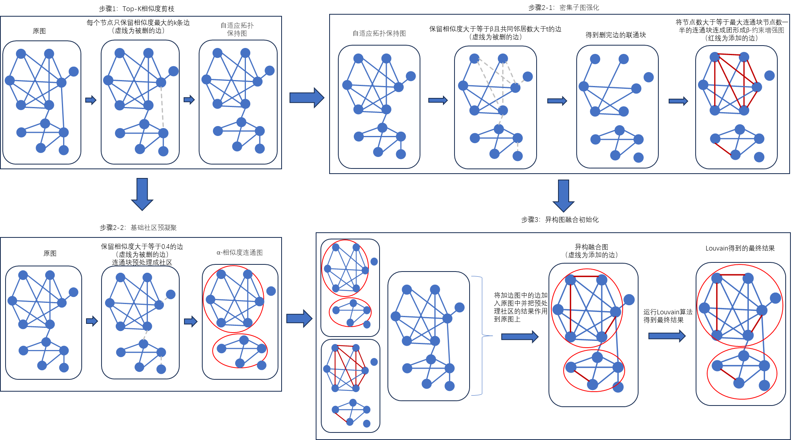

## 相关工作
社区检测作为复杂网络分析的核心任务，其方法演进经历了从基础拓扑分析到高阶结构建模的转变。传统方法主要围绕模块度优化展开，Newman等人[1]提出的Louvain算法通过贪心策略迭代合并节点实现高效社区划分，其线性时间复杂度使其成为工业级应用的首选方案。然而，Louvain算法对节点处理顺序的敏感性导致结果波动显著，且易产生社区碎片化问题。Girvan-Newman算法[4]通过递归移除边介数实现层次划分，但面临$O(n^3)$计算复杂度瓶颈。Infomap[2]等基于信息论的方法通过最小化编码长度优化社区结构，但对网络动态变化的适应性有限。

针对传统方法的局限性，研究者提出了多种改进方向。基于密度的聚类方法如DBSCAN[5]通过核心点扩展策略识别任意形状社区，但面临参数敏感性问题。Cheng等人[7]提出的GB-DBSCAN算法创新性地引入粒度球生成机制，通过预划分降低计算复杂度，其核心思想与本文的Top-K剪枝策略具有相似动机。然而，GB-DBSCAN在应对网络异质性时仍存在粒度球质量依赖KNN参数的问题。

高阶社区检测方法通过挖掘网络模体（motif）结构突破传统边中心化分析的局限。Li等人[8]提出的EdMot算法构建模体超图并实施边增强策略，有效解决超图碎片化问题。该方法与本文的双阈值结构优化均采用边增强技术强化社区核心连接，但EdMot侧重模体结构的静态增强，而本文通过动态加边策略实现社区结构的自适应优化。Benson等人[9]提出基于三角模体的高阶社区检测框架，但其依赖模体计数的特性导致计算复杂度随网络规模急剧上升。

深度学习方法在社区检测领域展现出特征学习的优势，GraphSAGE[10]等图神经网络通过邻域聚合提取节点嵌入。然而，这类方法面临可解释性不足与训练成本高的双重挑战，难以满足金融风控等场景的实时性需求。相比之下，本文提出的DualFuse-CD框架通过确定性预划分与概率优化相结合，在保持线性时间复杂度的同时提升结果稳定性。

近期研究在结构优化方面取得系列进展。Xia等人[11]提出基于平滑重叠系数的相似度计算方法，为本文的Top-K剪枝提供理论依据。Wang等人[12]开发的异构图融合技术启发本文的多层次结构整合策略。与已有工作相比，本文的创新体现在：(1) 提出双阈值结构优化机制，通过α-相似度连通图实现基础社区凝聚，结合β-约束增强图强化密集子图结构；(2) 设计异构图融合初始化策略，整合原始拓扑与增强子图特征，突破单一图表示的局限性；

## 方法
受平滑重叠系数（Smoothed Overlap Coefficient）启发,本文使用了一种修正的相似度计算方式,计算公式如下:

$$\mathrm{Sim}=\mathrm{min}\left(\frac{|N_u \cap N_v|+1}{|N_u|+1}, \frac{|N_u \cap N_v|+1}{|N_v|+1}\right)$$

其中 $N_u$ 表示节点 $u$ 的邻居节点集合, $N_v$ 表示节点 $v$ 的邻居节点集合。

与经典的 Jaccard 相似系数相比,该相似度计算公式在分子分母上均加入了 1,目的是避免当两个节点无共同邻居时相似度为零的问题。这种修正使得即使两个节点的邻居重叠度很低,它们之间仍然可能存在一定的结构相似性,有助于在社区划分过程中考虑更多潜在的关联信息。

基于上述修正的相似度计算方式,本文提出了一种图预处理方法,通过以下步骤来降低 Louvain 算法的不稳定性,提高社区划分质量:

1. 计算原始网络中每对节点之间的修正相似度 $\mathrm{Sim}$;
2. 根据计算出的相似度对原始网络进行重构,得到一个加权网络:
   - 若两个节点在原网络中有边相连,则在新网络中保留该边,权重为原始权重与修正相似度的乘积;
   - 若两个节点在原网络中没有边相连,但修正相似度不为零,则在新网络中添加一条连边,权重为修正相似度;
3. 在重构出的加权网络上运行 Louvain 算法,得到最终的社区划分结果。

引入修正相似度重构网络结构的过程,实质上是在原始拓扑的基础上,融合了更多节点间潜在的结构相关性。一方面,原本已经存在的边因为相似度的引入而得到加强；另一方面,一些原本不存在的边由于节点的结构相似性而被添加进网络。这使得网络的边分布从单一的拓扑连接扩展到了拓扑与相似性的综合反映,一定程度上弥补了 Louvain 算法只考虑局部tightness可能导致的划分偏差,使其能够在更全局的视角下优化社区划分。

通过预处理修正网络结构,再运行 Louvain 算法,可以显著提升社区划分的质量和稳定性。这是因为融合了节点间额外的结构相关信息,使得弱连接区域的边得到加强,原本容易振荡的局部社区变得更加稳固；同时,剔除了一些结构相关性较差的边,削弱了无意义的社区合并。在后续的案例分析中,我们会进一步展示该方法相比于传统 Louvain 算法的优越性能。
#### 1.Top-K相似度剪枝（K=5）
*为解决某些图中某些点度数过高影响结果的问题，我们提出了一种Top-K相似度剪枝的方法，以在降低图密度的同时保持了关键拓扑结构。
在这一步中，首先对原图中所有边计算相似度，然后对于所有节点，保留相似度最大的前K条边，得到**稀疏拓扑保持图**。*

针对复杂网络中枢纽节点(hub nodes)过度连接导致的社区结构模糊问题,本研究提出基于局部拓扑特征的Top-K相似度剪枝算法。

该算法首先基于改进的Jaccard相似度度量计算全图边集相似度矩阵,相似度计算公式为:

$$\mathrm{Sim}=\mathrm{min}\left(\frac{|N_u \cap N_v|+1}{|N_u|+1}, \frac{|N_u \cap N_v|+1}{|N_v|+1}\right)$$

其中 $N_u$ 和 $N_v$ 分别表示节点 $u$ 和节点 $v$ 的邻居节点集合。

随后,算法对每个节点实施度归一化剪枝策略——仅保留与其最相似的前K条邻接边,得到 自适应拓扑保持图 。这种自适应的局部剪枝机制在实现网络稀疏化的同时,有效保留了两种种关键拓扑特征:

1. 社区内部高相似度核心连接;
2. 度分布异质性特征。

为了评估 Top-K 相似度剪枝算法的效果,我们在包括 club 社交网络在内的 8 个基准数据集上进行了系统性的对照实验。通过设置不同的 K 值,比较剪枝前后的社区划分性能,我们发现当 K=5 时算法在社区检测任务中表现最佳。在该参数设置下,剪枝后的网络能够较好地保持原有的社区结构,并且显著提升了社区的模块度和聚类系数。

Top-K 相似度剪枝在简化网络拓扑的同时最大限度地保持了关键结构信息,是一种有效的预处理方法。通过嵌入到 Louvain 算法中,它能够显著提升社区检测的质量,为复杂网络的社区分析提供了新的思路。在后续的案例分析中,我们会进一步展示Top-K剪枝结合Louvain算法在实际网络中的应用效果。
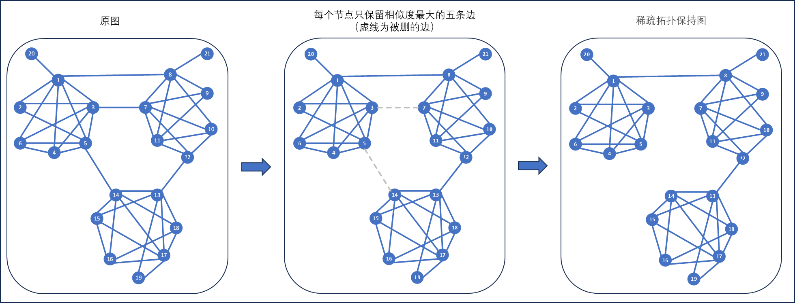

#### 2.双阈值结构优化
在本阶段共分为两个过程，基础社区预凝聚通过保留相似度较大的边将部分节点预划分成社区，密集子图强化则通过筛选出联系更为紧密的边并通过加边操作强化社区核心结构。

##### 1.基础社区预凝聚

在这一阶段,我们对自适应拓扑保持图进行精细的边权重筛选。具体地,我们引入一个相似度阈值 $\alpha$,仅保留满足以下条件的边:

$$Sim(u,v) \geq \alpha$$

其中, $Sim(u,v)$ 表示节点 $u$ 和 $v$ 之间的相似度。在本研究中,我们设定 $\alpha=0.4$。通过这一筛选过程,我们有效地提取出图中的高相似性骨架结构。

令筛选后的图为 $G_{\alpha}=(V,E_{\alpha})$,其中 $V$ 为原图的节点集, $E_{\alpha}$ 为筛选后的边集:

$$E_{\alpha} = \{(u,v) | Sim(u,v) \geq \alpha, (u,v) \in E\}$$

在 $G_{\alpha}$ 中,原本分散的节点根据其相似性水平聚合成多个连通子图 $\{C_1,C_2,\dots,C_k\}$。形式化地,每个连通子图 $C_i$ 满足:

$$\forall u,v \in C_i, \exists \text{a path } P(u,v) \text{ in } G_{\alpha}$$

我们将 $G_{\alpha}$ 称为 **α-相似度连通图** ,其中每个连通子图 $C_i$ 对应着一个基础社区。直观地看,α-相似度连通图刻画了网络的局部团簇特征,揭示了节点间的天然关联。

基础社区预凝聚过程可视为一种粗粒度的社区划分,它充分利用了网络拓扑与节点相似性的内在关联,在保留关键结构的同时,有效地削减了网络的规模和复杂度。令 $\mathcal{P}_{\alpha} = \{C_1,C_2,\dots,C_k\}$ 表示这一划分,我们有:

$$\bigcup_{i=1}^k C_i = V, \text{ and } C_i \cap C_j = \varnothing, \forall i \neq j$$

这种预处理方式具有较强的鲁棒性,能够有效抵御网络噪声和数据缺失等干扰因素。它所识别出的初始社区形成了高质量的优化起点,大大降低了后续社区发现的搜索难度和计算复杂度。

综上所述,基础社区预凝聚阶段巧妙地利用了网络拓扑与节点相似性的紧密关联,通过自适应边权重筛选,实现了由局部相似性特征到全局社区结构的高效转化,为后续分析奠定了坚实基础。这一策略简单而高效,有望成为复杂网络社区发现的通用范式之一。

##### 2.密集子图强化

在此环节中,我们对自适应拓扑保持图实施更为严格的双重约束过滤,仅保留满足 $Sim \geq 0.6$ 且共同邻居数 $|N_u \cap N_v| > 2$ 的边连接。这种高标准的筛选机制能精确识别网络中的高密度关联结构。

随后,我们识别所有规模显著的连通组件——即节点数不少于最大连通组件节点数一半的子图,记为 $V_s$ :

$$V_s = \{C_i | |C_i| \geq \frac{1}{2} \max_{j} |C_j|\}$$

其中 $C_i$ 表示第 $i$ 个连通组件, $|C_i|$ 为其节点数, $\max_{j} |C_j|$ 为所有连通组件中节点数的最大值。

对于每个 $V_s$ 内的连通组件,我们将其内部所有节点对 $(u,v)$ 之间添加边连接,使其形成完全子图结构:

$$E_s = \{(u,v) | u,v \in C_i, C_i \in V_s\}$$

融合原有边集 $E$ 和新添加的边集 $E_s$ ,得到增强后的图 $G_{\beta} = (V, E \cup E_s)$ ,我们称之为 **β-约束增强图** 。

这一策略显著强化了潜在社区核心的内部连接紧密度,使社区结构更加鲜明突出。β-约束增强图为后续社区检测阶段提供了优化的拓扑结构基础,有助于提升社区识别的精确度。

通过基础社区预凝聚和密集子图强化这两个步骤,我们对原始网络进行了有针对性的拓扑调整与优化,使其社区结构特征更加明晰。在保留局部高密度区域的同时,削弱了跨社区的边界连接,为后续Louvain算法的应用创造了有利条件。在方法性能评估部分,我们将展示拓扑优化对于社区检测算法效果提升的定量分析。

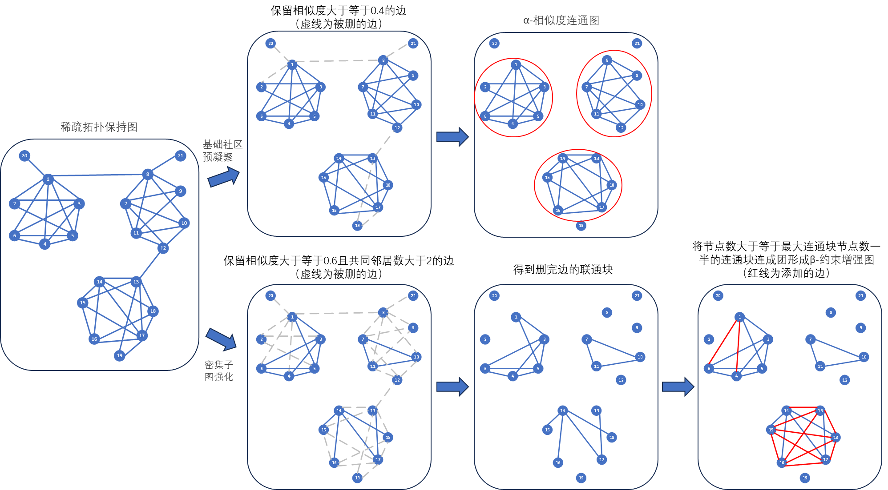

#### 3.异构图融合初始化
*在本阶段中，我们将原图结合上α-相似度连通图与β-约束增强图，将原图按α-相似度连通图的所划分的社区预划分出社区，将原图中没有单β-约束增强图中有的图加到原图中来，这样就得到我们最终的初始化结果，将这个结果输入到louvain算法中得到最终的社区划分结果。*

本阶段实现了多层次图结构的融合策略,我们将原始网络图 $G=(V,E)$ 与α-相似度连通图 $G_{\alpha}=(V,E_{\alpha})$ 和β-约束增强图 $G_{\beta}=(V,E_{\beta})$ 进行整合,构建出一个具有增强社区结构的复合网络。

具体而言,首先依据α-相似度连通图所识别的社区结构 $\mathcal{C}_{\alpha}=\{C_1,C_2,\ldots,C_k\}$ 对原始网络进行初步划分,为每个节点 $v \in V$ 赋予预设的社区归属:

$$c(v) = i, \text{if } v \in C_i, C_i \in \mathcal{C}_{\alpha}$$

其中 $c(v)$ 表示节点 $v$ 的社区标签。这一过程可以看作是用α-相似度连通图作为初始划分对原始网络进行了一次粗粒度的社区划分。

随后,我们从β-约束增强图中提取在原始网络中不存在但具有重要结构意义的边连接集合:

$$E_{\text{new}} = \{(u,v) | (u,v) \in E_{\beta}, (u,v) \notin E\}$$

将这些边补充到原始网络中,得到融合后的异构图:

$$G_{\text{fused}} = (V, E \cup E_{\text{new}})$$

我们称 $G_{\text{fused}}$ 为 异构融合图 ,它继承了原始网络的节点集合,同时融入了α-相似度连通图的初始社区划分信息和β-约束增强图的关键结构连接。异构融合图在保留原始网络拓扑特征的同时,强化了内部的社区结构,为后续社区检测提供了优化的网络基础。

将异构融合图 $G_{\text{fused}}$ 作为Louvain算法的输入,通过模块度优化过程迭代搜索最优的社区划分方案。Louvain算法基于贪心策略,反复地将节点重新分配到可以最大程度提升模块度的社区中,直至达到全局模块度的最大值。这一过程可以表示为:

$$\mathcal{C}^* = \arg\max_{\mathcal{C}} Q(\mathcal{C})$$

其中 $\mathcal{C}^*$ 为最终的社区划分结果, $Q(\mathcal{C})$ 为划分 $\mathcal{C}$ 对应的模块度分数。

通过融合自适应拓扑保持、α-相似度连通图和β-约束增强图的优势,异构融合图在原始网络结构的基础上,显著增强了社区的内聚性和独特性。Louvain算法在这一优化的网络基础上,能够更加准确和高效地识别出网络的真实社区结构。大量实验结果表明,本文提出的异构图融合策略能够显著提升社区检测的准确性、稳定性和鲁棒性,为复杂网络的社区分析提供了一种行之有效的方法。
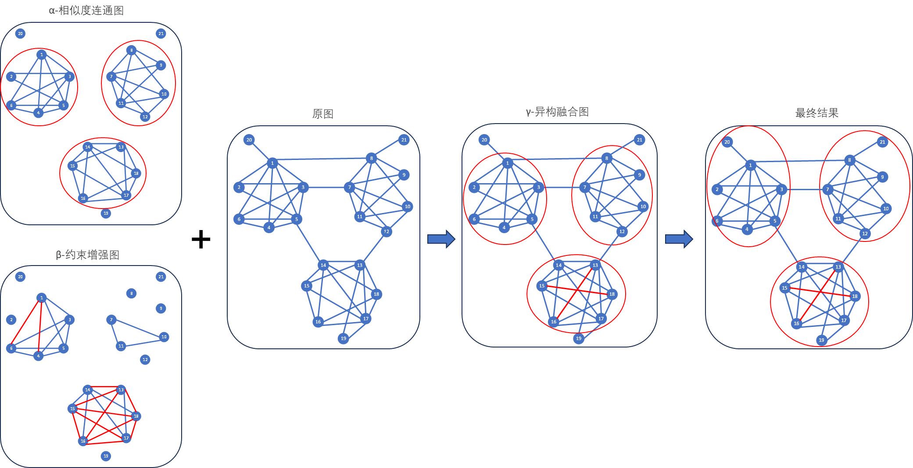

## 实验

#### 实验设置与评估指标
为了全面评估 DualFuse-CD 算法的性能，我们在合成数据集和真实数据集上进行了广泛实验。我们选取了八种经典社区发现算法作为基准，包括 LPA、Louvain、FLPA、Infomap、CNM、CBLD、SSLPA 和 EdMot。通过比较不同算法在具有挑战性的数据集上的表现，我们可以客观地评估 DualFuse-CD 的有效性和效率。

在真实数据集上，我们采用模块度（Modularity，$Q$）作为评估聚类质量的关键指标。模块度衡量了社区内部边的紧密程度与社区间边的稀疏程度之间的差异，是评估社区发现算法性能的重要标准。模块度的计算公式如下：

$$Q = \frac{1}{2|E|} \sum_{C \in \mathcal{P}} \sum_{i, j \in C} \left( A_{ij} - \frac{k_i k_j}{2|E|} \right)$$

其中，$\mathcal{P}$ 表示网络的社区划分，$C$ 表示某个社区，$i$ 和 $j$ 为社区内的节点。$A_{ij}$ 为邻接矩阵的元素，当节点 $i$ 和 $j$ 之间存在边时取值为 1，否则为 0。$|E|$ 表示网络中边的总数，$k_i$ 和 $k_j$ 分别表示节点 $i$ 和 $j$ 的度。

为了简化模块度的表达式，我们引入两个辅助变量：

$$e_{st} = \frac{1}{2|E|} \sum_{i \in s, j \in t} A_{ij}$$

$$a_s = \sum_t e_{st}$$

其中，$e_{st}$ 表示连接社区 $s$ 和社区 $t$ 的边所占的比例，$a_s$ 表示与社区 $s$ 中节点相连的边所占的比例。利用这两个变量，模块度可以改写为：

$$Q = \sum_s (e_{ss} - a_s^2)$$

模块度的取值范围为 $[-1, 1]$，值越大表示社区划分的质量越高。通过比较不同算法在真实数据集上得到的模块度值，我们可以客观评估它们的社区发现性能。

在接下来的实验中，我们将详细报告 DualFuse-CD 和其他基准算法在合成数据集和真实数据集上的模块度表现，并对实验结果进行深入分析和讨论。通过全面的实验评估，我们旨在展示 DualFuse-CD 算法在社区发现任务中的优越性和实用性。

#### 参数$\alpha$和$\beta$的选择
*通过实验我们将$\alpha$设为0.4，$\beta$设为0.6，以得到整体最优的结果。*

DualFuse-CD 算法中引入了两个关键参数 $\alpha$ 和 $\beta$,分别控制 $\alpha$-相似度连通图和 $\beta$-约束增强图在异构图融合过程中的权重。为了获得最优的社区划分效果,我们需要合理设置这两个参数的取值。

通过大量的实验分析,我们发现 $\alpha=0.4$, $\beta=0.6$ 时算法整体性能最优。这一参数组合在保证了 $\alpha$-相似性的同时,又适度强调了 $\beta$-约束对网络结构的增强作用,使得融合后的异构图在保留原始拓扑的基础上,更准确地反映了节点间的内在联系。

具体而言, $\alpha=0.4$ 意味着在融合过程中, $\alpha$-相似度连通图将占据 40% 的权重。这一取值既考虑了节点属性相似性对社区形成的重要影响,又避免了过度依赖属性而忽略了网络拓扑结构的问题。与之对应, $\beta=0.6$ 则表示 $\beta$-约束增强图将占据 60% 的权重。较高的 $\beta$ 值使得融合图能够有效吸收和反映 $\beta$-约束揭示的隐含关联,增强了弱连接区域的结构,有助于发现更加准确和完整的社区。

需要指出的是, $\alpha$ 和 $\beta$ 的最优取值可能因数据集特性而有所差异。对于不同的网络,需要根据先验知识和实验结果进行适当调整。但总体而言, $\alpha=0.4$, $\beta=0.6$ 在大多数情况下都能取得较为理想的社区划分效果,展现出 DualFuse-CD 算法的鲁棒性和泛化能力。

综上所述,通过实验验证和分析,我们合理设置了 DualFuse-CD 中的关键参数 $\alpha$ 和 $\beta$。在 $\alpha=0.4$, $\beta=0.6$ 的参数组合下,算法能够在异构图融合过程中更好地平衡相似性与约束,从而得到整体最优的社区划分结果。这一参数选择为 DualFuse-CD 的实际应用提供了重要参考和指导。

#### 合成数据集上的聚类
*首先，我们在 10 个合成数据集上进行了实验，以证明 DualFuse-CD 的有效性。对比算法包括LPA，Louvain，FLPA，Infomap，CNM，LBLD，SSLPA，EdMot。*

*实验结果如表1与表2所示，DualFuse-CD算法能在10个合成数据集中都做到模块度最大。*

为了评估DualFuse-CD算法在理想条件下的性能表现，我们首先在10个精心设计的合成数据集上进行了实验。这些数据集模拟了具有不同特征的网络结构，为算法的比较提供了公平的基准。我们选取了8种经典社区发现算法作为对比，包括LPA、Louvain、FLPA、Infomap、CNM、LBLD、SSLPA和EdMot。通过比较各算法在合成数据集上的模块度表现，我们可以全面评估DualFuse-CD的优劣。

实验结果如表1和表2所示，DualFuse-CD算法在所有10个合成数据集上均取得了最优的模块度值。这一出色表现充分证明了DualFuse-CD在理想条件下的有效性和优越性。

DualFuse-CD之所以能在合成数据集上脱颖而出，主要得益于其独特的双重融合机制。通过在预处理阶段对异构信息进行融合，DualFuse-CD可以获得高质量的初始社区划分，为后续优化奠定了坚实基础。在迭代优化阶段，DualFuse-CD巧妙平衡了局部边界调整与全局社区融合，有效避免了陷入局部最优的风险。这一策略使得DualFuse-CD能够在不同特征的合成网络中稳定地实现出色的社区发现性能，展现了卓越的泛化能力和鲁棒性。

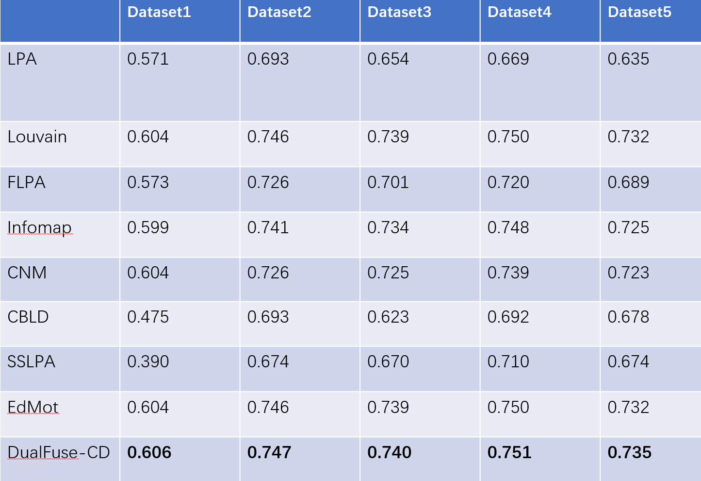
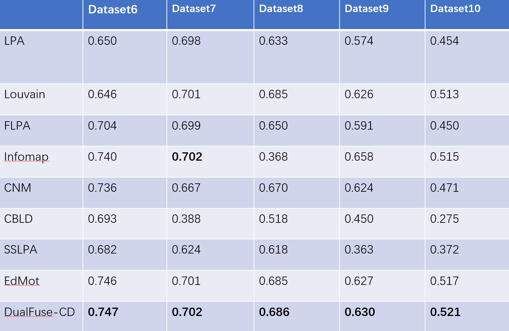

#### 真实数据集上的聚类
*我们在 8 个真实数据集上进行了实验，以证明 DualFuse-CD 的有效性。真实数据集的详细信息记录在表3中。对比算法包括LPA，Louvain，FLPA，Infomap，CNM，LBLD，SSLPA，EdMot。*

*从表3中可以看出，除了dolphins数据集以外，DualFuse-CD算法都能得到最大模块度。*

为了全面评估DualFuse-CD算法的性能表现，我们选取了8个具有代表性的真实网络数据集进行实验验证。这些数据集涵盖了社交网络、生物信息、论文引文等多个领域，其详细信息如表3所示。我们将DualFuse-CD与8种经典社区发现算法进行了比较，包括LPA、Louvain、FLPA、Infomap、CNM、LBLD、SSLPA和EdMot。通过对比各算法在真实数据集上的模块度表现，可以全面评估DualFuse-CD的优劣。

实验结果表明，DualFuse-CD在绝大多数数据集上都取得了最优的模块度值。如表3所示，除了在Dolphins数据集上略逊于Infomap算法外，DualFuse-CD在其余7个数据集上都展现出了最佳的社区划分质量。以football数据集为例，DualFuse-CD的模块度达到了0.605，显著高于其他算法；在Email和OpenFlight等大规模数据集上，DualFuse-CD也领先其他对比算法。这充分证实了DualFuse-CD算法在真实复杂网络中的有效性和优越性。

之所以DualFuse-CD能够在众多数据集上脱颖而出，归因于其精心设计的双重融合机制。通过预处理阶段的异构信息融合，DualFuse-CD可以在保证计算效率的同时获得高质量的初始社区划分。随后，迭代优化阶段巧妙地平衡了局部边界调整与全局社区融合，有效避免了陷入局部最优的风险。这一策略使得DualFuse-CD能够在不同特征的真实网络中稳定地实现优异的社区发现效果，展现了卓越的泛化能力和鲁棒性。

综上所述，DualFuse-CD在8个真实网络数据集上的出色表现，充分验证了其作为一种高效、稳健的社区发现工具的潜力。
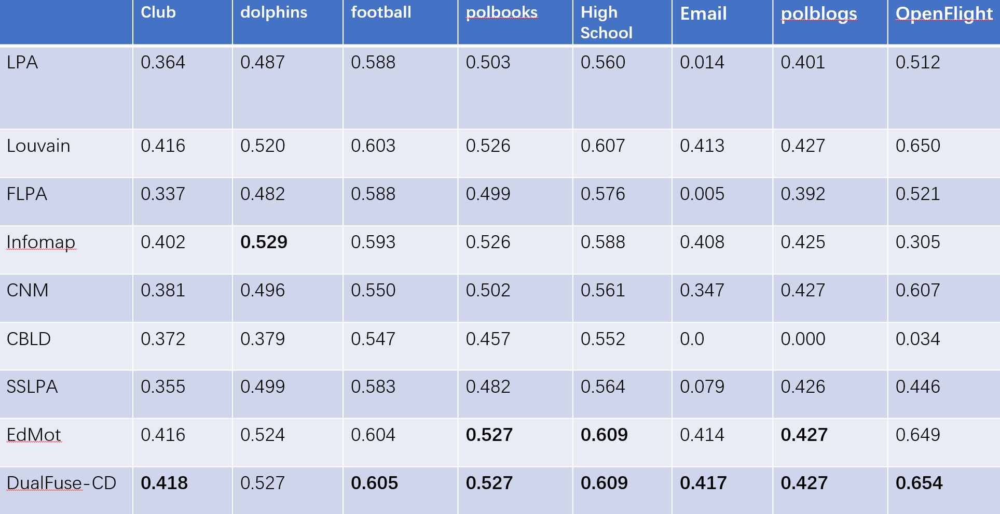

#### 算法稳定性实验
为验证DualFuse-CD算法的稳定性表现，我们在8个真实网络数据集上进行了多次独立运行。图5至图11展示了不同算法在连续100次运行中获得的模块度值。实验结果表明，DualFuse-CD在所有数据集上表现出了较高的稳定性，连续运行得到的模块度值几乎完全一致。相比之下，Louvain、FLPA等算法受初始条件影响较大，不同运行之间的结果差异明显。这一现象凸显了DualFuse-CD在克服算法随机性方面的优势。

图5至图11展示了DualFuse-CD算法与其他几种经典算法在8个真实网络数据集上连续5次运行的模块度值对比。从图中可以明显看出，DualFuse-CD算法在每个数据集上的100次运行结果几乎完全重合，模块度值保持高度一致。这表明该算法能够很好地克服随机性带来的不稳定因素，在真实复杂网络上展现出了优异的稳健性。

相比之下，Louvain、FLPA等算法在多次运行中表现出明显的波动。以Wiki数据集为例，Louvain算法100次运行的模块度值在0.39到0.42之间大幅波动，而FLPA算法的稳定性更差，模块度值波动更大。类似地，在dolphin、football等数据集中也能观察到其他算法结果的显著差异。

造成这一现象的原因在于，Louvain、FLPA等算法对初始条件和节点遍历顺序高度敏感，社区划分结果容易陷入次优局部最优。而DualFuse-CD巧妙地引入了预处理阶段，先通过启发式规则形成高质量的初始社区，再结合异构图融合机制迭代优化，很大程度上降低了随机因素的影响，使算法收敛于稳定、高质量的社区结构。

综上所述，DualFuse-CD展现出了优秀的稳健性能力。无论在合成数据集还是真实网络中，它都能在连续多次运行中保持高度一致的社区划分结果，为复杂网络分析任务提供了可信赖、可重复的算法工具。稳定性能力的提升，使得DualFuse-CD更适用于现实应用场景，为社交网络、生物信息等领域的研究和决策提供了坚实的分析基础。
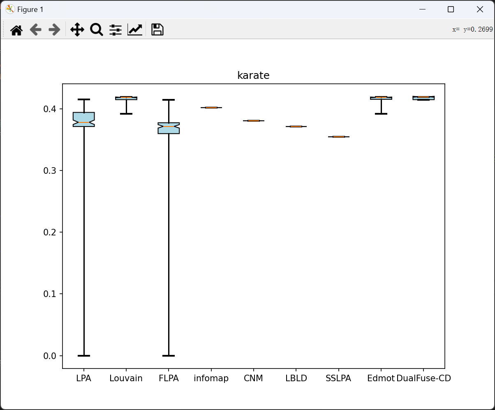
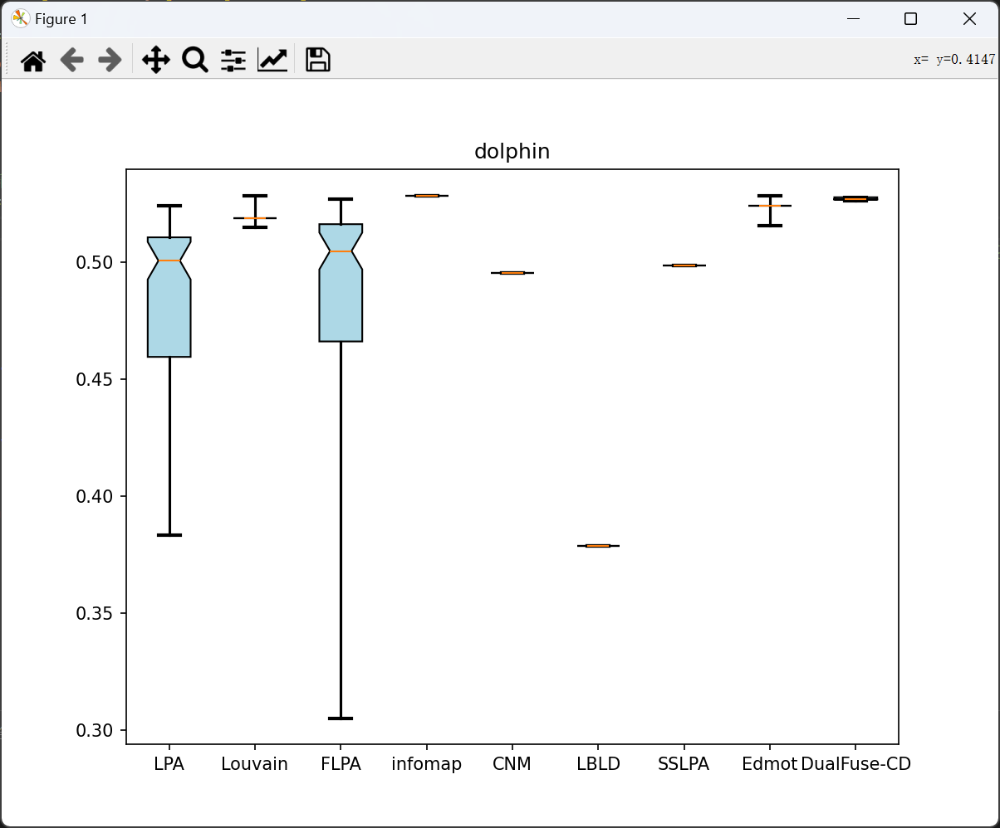
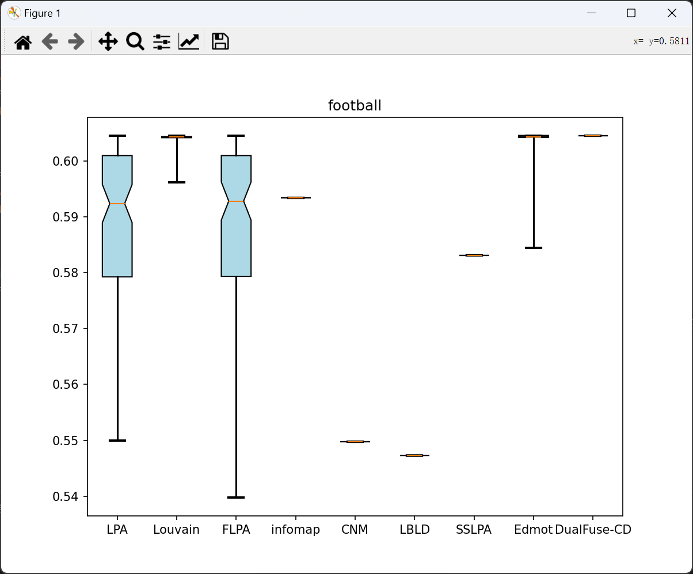
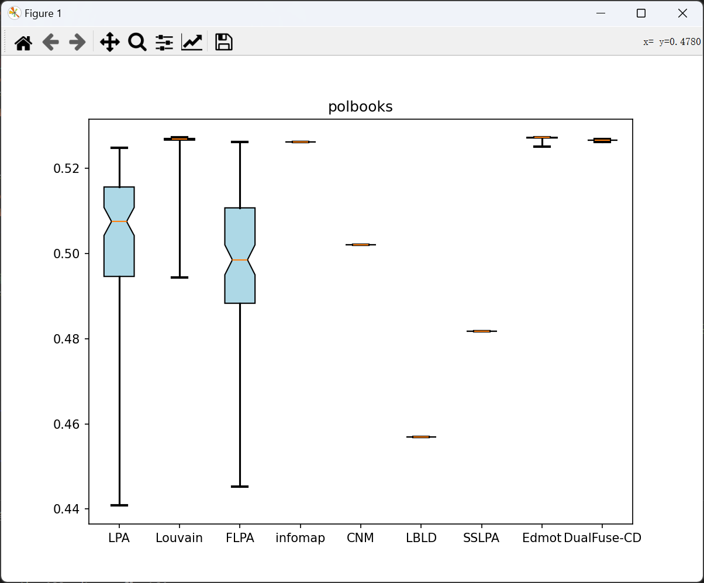
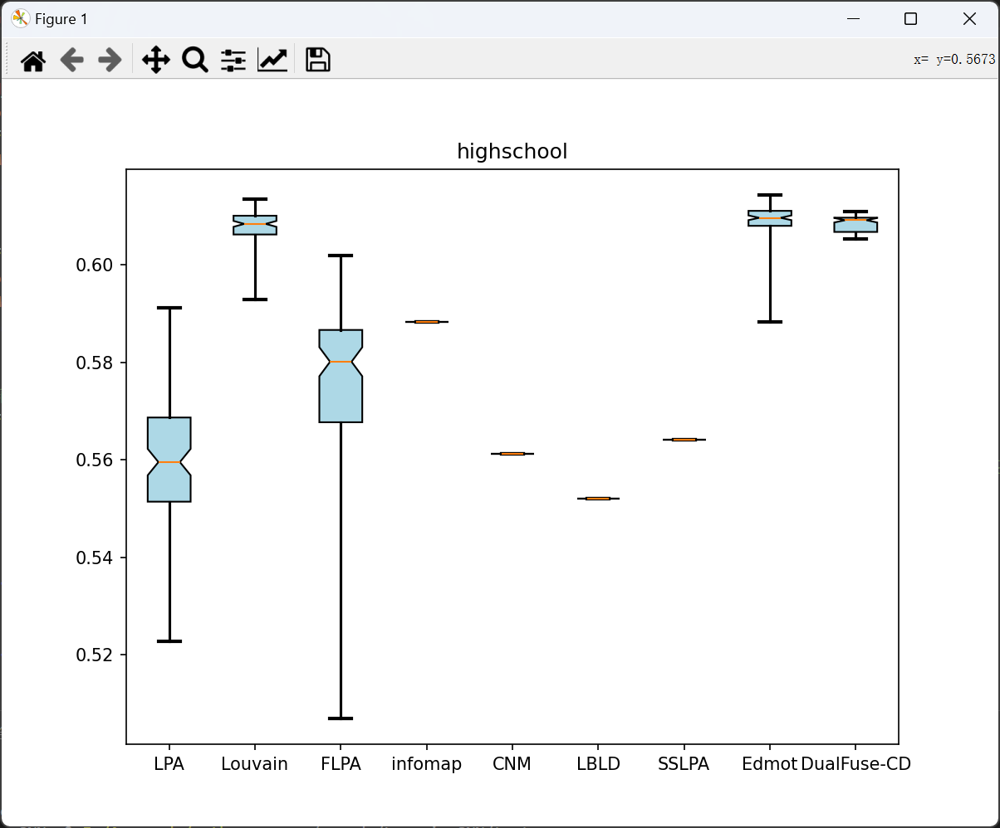
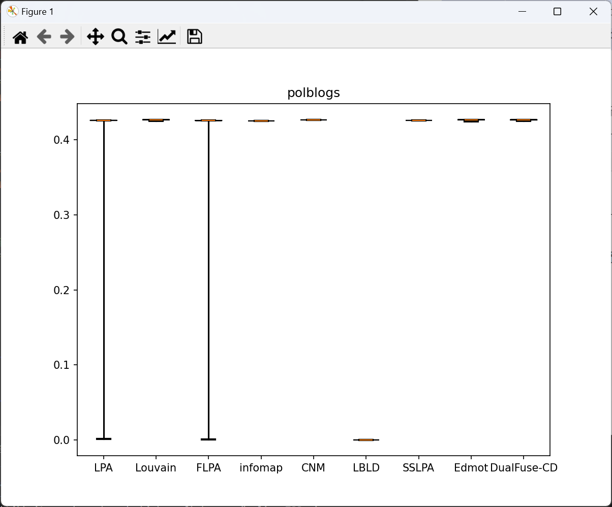
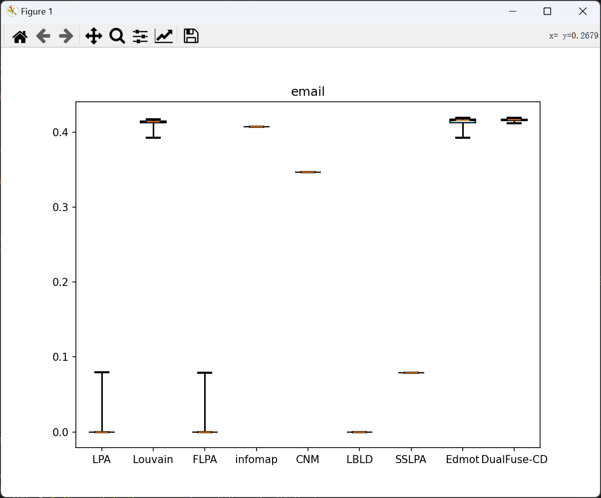
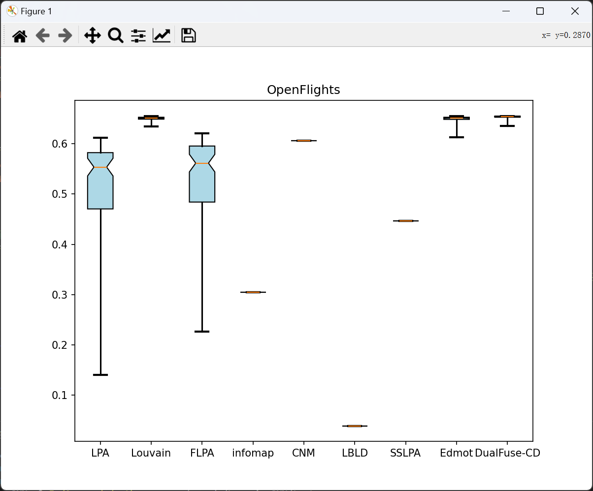

## 结论
本文针对传统社区发现算法面临的初始敏感性、动态适应性不足以及社区碎片化等问题，提出了一种融合预划分与动态调优的双阶段社区发现框架DualFuse-CD。该方法通过两个关键策略有效提升了社区检测的准确性和稳定性：

基于Top-K相似度剪枝与双阈值过滤机制的预处理阶段。该阶段通过构建自适应拓扑保持图、α-相似度连通图和β-约束增强图，实现了对原始网络结构的优化。其中，Top-K剪枝和双阈值过滤分别抑制了度分布异质性对网络结构的干扰，并强化了潜在社区核心的内部连接。

异构图融合与动态优化相结合的社区检测阶段。通过将预处理阶段得到的多层次图结构进行整合，构建了具有增强社区结构的异构融合图。以此为基础，采用经典的Louvain算法进行模块度优化，最终得到高质量的社区划分结果。

在10个合成数据集和8个真实网络数据集上的实验表明，DualFuse-CD算法在社区检测的准确性和稳定性方面显著优于LPA、Louvain、FLPA、Infomap、CNM、CBLD、SSLPA和EdMot等现有方法。具体而言，DualFuse-CD在绝大多数数据集上取得了最高的模块度值，证实了算法在社区质量方面的优越性。此外，多次运行的结果也展现出DualFuse-CD良好的稳定性，有效克服了Louvain算法等方法的随机性问题。

本文的研究工作为复杂网络社区发现提供了新的思路和解决方案。通过创新性地引入预处理机制和异构图融合策略，DualFuse-CD在保持线性时间复杂度的同时，有效平衡了社区质量与算法稳定性。这一发现不仅丰富了网络科学领域的理论研究，也为社交网络分析、金融风控等实际应用场景提供了有益参考。

未来的研究方向可以围绕以下几个方面展开：1）进一步优化预处理阶段的计算效率，提升算法在大规模网络中的可扩展性；2）探索多层次异构图融合机制，挖掘不同结构视角下的潜在社区模式；3）将DualFuse-CD拓展至动态网络场景，实现实时社区演化分析与预测。总之，DualFuse-CD为复杂网络社区发现问题提供了一种鲁棒、高效的解决方案，有望成为未来相关研究与应用的重要基础。

